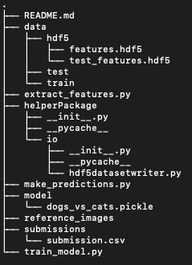
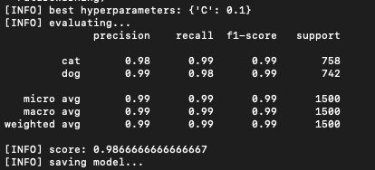

# Dogs versus Cats
***


***
# Table of Contents
***
- [Intoduction](#introduction)
- [Transfer Learning](#transferLearning)

    - [What is Transfer Learning?](#whatIsTransferLearning)
    - [Treating networks as Feature Extractors](#featureExtractors)
    
- [ResNet-50](#resNet)

    - [ResNet](#resNetArchitecture)
    - [Why ResNet?](#whyResNet)
    
- [Approach](#approach)
- [Directory structure](#directoryStructure)
- [Steps to execute](#stepsToExecute)
- [Evaluation](#evaluation)
- [Conclusion](#conclusion)

<a id = "introduction"></a>
# Introduction
***
**Dogs vs. Cats** is a Kaggle competition which was posted on <a href = "https://www.kaggle.com/c/dogs-vs-cats">Kaggle</a>, 5 years ago. The competition was to write an algorithm to classify whether image contains a dog or a cat. The competition is already closed. However, I have used the same dataset to pursue the project and accomplished **accuracy upto top 2 on Leaderboard on Kaggle**.

Data: <a href = "https://www.kaggle.com/c/dogs-vs-cats/data">source</a>

<i>Note: I used only total of 6k images, out of 25k, to train and test the model. I trained the model on 4500 images, and tested it on 1500 images.</i>

<a id = "transferLearning"></a>
# Transfer Learning
***


<a id = "whatIsTransferLearning"></a>
## What is Transfer Learning?
***
Transfer learning is a machine learning technique where a model trained on one task is re-purposed on a second related task. In other words, it is the ability to use a pre-trained model as a “shortcut” to learn patterns from data it was not originally trained on.

Essentially, transfer learning is of two kinds:
1. Treating networks as arbitrary feature extractors
2. Removing the fully-connected layers of an existing network, placing new FC layer set on top of the CNN, and fine-tuning these weights (and optionally previous layers) to recognize object classes

For this project, I am using the first method of transfer learning, treating a network as feature extractors.

<a id = "featureExtractors"></a>
## Treating networks as feature extractors
***
Normally in a Convolutional Neural Network, we input an image to the network, the image forward propagates through the network and then we obtain the final classification probabilities from the end of the network. However, for feature extraction, we stop the propagation at an arbitrary layer (such as an activation or pool layer), extract the values from the network and use it as feature vectors.

To solve the problem of Dogs and Cats image classification, I have used **ResNet architecture** to extract features.

***
<a id = "resNet"></a>

***

<a id = "resNetArchitecture"></a>
# ResNet
***
ResNet is short for **Residual Network**. 

Network depth is of crucial importance in neural network architectures. But, with increasing network depth, accuracy gets saturated and then degrades rapidly. Unexpectedly, such degradation is not caused by overfitting, and adding more layers to a suitably deep model leads to higher training error. The residual learning framework eases the training of these networks, and enables them to be substantially deeper — leading to improved performance in both visual and non-visual tasks.

These networks led to 1st-place winning entries in all five main tracks of the ImageNet and COCO 2015 competitions, which covered image classification, object detection, and semantic segmentation.

More about Residual Network on <a href = "https://arxiv.org/pdf/1512.03385.pdf">here</a>.

Given below is the network architecture of ResNet-50:


```python
from keras.applications import ResNet50
model = ResNet50(weights="imagenet", include_top=False)
model.summary()
```

    /Users/bishwaraj/.local/lib/python3.6/site-packages/keras_applications/resnet50.py:265: UserWarning: The output shape of `ResNet50(include_top=False)` has been changed since Keras 2.2.0.
      warnings.warn('The output shape of `ResNet50(include_top=False)` '


    __________________________________________________________________________________________________
    Layer (type)                    Output Shape         Param #     Connected to                     
    ==================================================================================================
    input_2 (InputLayer)            (None, None, None, 3 0                                            
    __________________________________________________________________________________________________
    conv1_pad (ZeroPadding2D)       (None, None, None, 3 0           input_2[0][0]                    
    __________________________________________________________________________________________________
    conv1 (Conv2D)                  (None, None, None, 6 9472        conv1_pad[0][0]                  
    __________________________________________________________________________________________________
    bn_conv1 (BatchNormalization)   (None, None, None, 6 256         conv1[0][0]                      
    __________________________________________________________________________________________________
    activation_50 (Activation)      (None, None, None, 6 0           bn_conv1[0][0]                   
    __________________________________________________________________________________________________
    pool1_pad (ZeroPadding2D)       (None, None, None, 6 0           activation_50[0][0]              
    __________________________________________________________________________________________________
    max_pooling2d_2 (MaxPooling2D)  (None, None, None, 6 0           pool1_pad[0][0]                  
    __________________________________________________________________________________________________
    res2a_branch2a (Conv2D)         (None, None, None, 6 4160        max_pooling2d_2[0][0]            
    __________________________________________________________________________________________________
    bn2a_branch2a (BatchNormalizati (None, None, None, 6 256         res2a_branch2a[0][0]             
    __________________________________________________________________________________________________
    activation_51 (Activation)      (None, None, None, 6 0           bn2a_branch2a[0][0]              
    __________________________________________________________________________________________________
    res2a_branch2b (Conv2D)         (None, None, None, 6 36928       activation_51[0][0]              
    __________________________________________________________________________________________________
    bn2a_branch2b (BatchNormalizati (None, None, None, 6 256         res2a_branch2b[0][0]             
    __________________________________________________________________________________________________
    activation_52 (Activation)      (None, None, None, 6 0           bn2a_branch2b[0][0]              
    __________________________________________________________________________________________________
    res2a_branch2c (Conv2D)         (None, None, None, 2 16640       activation_52[0][0]              
    __________________________________________________________________________________________________
    res2a_branch1 (Conv2D)          (None, None, None, 2 16640       max_pooling2d_2[0][0]            
    __________________________________________________________________________________________________
    bn2a_branch2c (BatchNormalizati (None, None, None, 2 1024        res2a_branch2c[0][0]             
    __________________________________________________________________________________________________
    bn2a_branch1 (BatchNormalizatio (None, None, None, 2 1024        res2a_branch1[0][0]              
    __________________________________________________________________________________________________
    add_17 (Add)                    (None, None, None, 2 0           bn2a_branch2c[0][0]              
                                                                     bn2a_branch1[0][0]               
    __________________________________________________________________________________________________
    activation_53 (Activation)      (None, None, None, 2 0           add_17[0][0]                     
    __________________________________________________________________________________________________
    res2b_branch2a (Conv2D)         (None, None, None, 6 16448       activation_53[0][0]              
    __________________________________________________________________________________________________
    bn2b_branch2a (BatchNormalizati (None, None, None, 6 256         res2b_branch2a[0][0]             
    __________________________________________________________________________________________________
    activation_54 (Activation)      (None, None, None, 6 0           bn2b_branch2a[0][0]              
    __________________________________________________________________________________________________
    res2b_branch2b (Conv2D)         (None, None, None, 6 36928       activation_54[0][0]              
    __________________________________________________________________________________________________
    bn2b_branch2b (BatchNormalizati (None, None, None, 6 256         res2b_branch2b[0][0]             
    __________________________________________________________________________________________________
    activation_55 (Activation)      (None, None, None, 6 0           bn2b_branch2b[0][0]              
    __________________________________________________________________________________________________
    res2b_branch2c (Conv2D)         (None, None, None, 2 16640       activation_55[0][0]              
    __________________________________________________________________________________________________
    bn2b_branch2c (BatchNormalizati (None, None, None, 2 1024        res2b_branch2c[0][0]             
    __________________________________________________________________________________________________
    add_18 (Add)                    (None, None, None, 2 0           bn2b_branch2c[0][0]              
                                                                     activation_53[0][0]              
    __________________________________________________________________________________________________
    activation_56 (Activation)      (None, None, None, 2 0           add_18[0][0]                     
    __________________________________________________________________________________________________
    res2c_branch2a (Conv2D)         (None, None, None, 6 16448       activation_56[0][0]              
    __________________________________________________________________________________________________
    bn2c_branch2a (BatchNormalizati (None, None, None, 6 256         res2c_branch2a[0][0]             
    __________________________________________________________________________________________________
    activation_57 (Activation)      (None, None, None, 6 0           bn2c_branch2a[0][0]              
    __________________________________________________________________________________________________
    res2c_branch2b (Conv2D)         (None, None, None, 6 36928       activation_57[0][0]              
    __________________________________________________________________________________________________
    bn2c_branch2b (BatchNormalizati (None, None, None, 6 256         res2c_branch2b[0][0]             
    __________________________________________________________________________________________________
    activation_58 (Activation)      (None, None, None, 6 0           bn2c_branch2b[0][0]              
    __________________________________________________________________________________________________
    res2c_branch2c (Conv2D)         (None, None, None, 2 16640       activation_58[0][0]              
    __________________________________________________________________________________________________
    bn2c_branch2c (BatchNormalizati (None, None, None, 2 1024        res2c_branch2c[0][0]             
    __________________________________________________________________________________________________
    add_19 (Add)                    (None, None, None, 2 0           bn2c_branch2c[0][0]              
                                                                     activation_56[0][0]              
    __________________________________________________________________________________________________
    activation_59 (Activation)      (None, None, None, 2 0           add_19[0][0]                     
    __________________________________________________________________________________________________
    res3a_branch2a (Conv2D)         (None, None, None, 1 32896       activation_59[0][0]              
    __________________________________________________________________________________________________
    bn3a_branch2a (BatchNormalizati (None, None, None, 1 512         res3a_branch2a[0][0]             
    __________________________________________________________________________________________________
    activation_60 (Activation)      (None, None, None, 1 0           bn3a_branch2a[0][0]              
    __________________________________________________________________________________________________
    res3a_branch2b (Conv2D)         (None, None, None, 1 147584      activation_60[0][0]              
    __________________________________________________________________________________________________
    bn3a_branch2b (BatchNormalizati (None, None, None, 1 512         res3a_branch2b[0][0]             
    __________________________________________________________________________________________________
    activation_61 (Activation)      (None, None, None, 1 0           bn3a_branch2b[0][0]              
    __________________________________________________________________________________________________
    res3a_branch2c (Conv2D)         (None, None, None, 5 66048       activation_61[0][0]              
    __________________________________________________________________________________________________
    res3a_branch1 (Conv2D)          (None, None, None, 5 131584      activation_59[0][0]              
    __________________________________________________________________________________________________
    bn3a_branch2c (BatchNormalizati (None, None, None, 5 2048        res3a_branch2c[0][0]             
    __________________________________________________________________________________________________
    bn3a_branch1 (BatchNormalizatio (None, None, None, 5 2048        res3a_branch1[0][0]              
    __________________________________________________________________________________________________
    add_20 (Add)                    (None, None, None, 5 0           bn3a_branch2c[0][0]              
                                                                     bn3a_branch1[0][0]               
    __________________________________________________________________________________________________
    activation_62 (Activation)      (None, None, None, 5 0           add_20[0][0]                     
    __________________________________________________________________________________________________
    res3b_branch2a (Conv2D)         (None, None, None, 1 65664       activation_62[0][0]              
    __________________________________________________________________________________________________
    bn3b_branch2a (BatchNormalizati (None, None, None, 1 512         res3b_branch2a[0][0]             
    __________________________________________________________________________________________________
    activation_63 (Activation)      (None, None, None, 1 0           bn3b_branch2a[0][0]              
    __________________________________________________________________________________________________
    res3b_branch2b (Conv2D)         (None, None, None, 1 147584      activation_63[0][0]              
    __________________________________________________________________________________________________
    bn3b_branch2b (BatchNormalizati (None, None, None, 1 512         res3b_branch2b[0][0]             
    __________________________________________________________________________________________________
    activation_64 (Activation)      (None, None, None, 1 0           bn3b_branch2b[0][0]              
    __________________________________________________________________________________________________
    res3b_branch2c (Conv2D)         (None, None, None, 5 66048       activation_64[0][0]              
    __________________________________________________________________________________________________
    bn3b_branch2c (BatchNormalizati (None, None, None, 5 2048        res3b_branch2c[0][0]             
    __________________________________________________________________________________________________
    add_21 (Add)                    (None, None, None, 5 0           bn3b_branch2c[0][0]              
                                                                     activation_62[0][0]              
    __________________________________________________________________________________________________
    activation_65 (Activation)      (None, None, None, 5 0           add_21[0][0]                     
    __________________________________________________________________________________________________
    res3c_branch2a (Conv2D)         (None, None, None, 1 65664       activation_65[0][0]              
    __________________________________________________________________________________________________
    bn3c_branch2a (BatchNormalizati (None, None, None, 1 512         res3c_branch2a[0][0]             
    __________________________________________________________________________________________________
    activation_66 (Activation)      (None, None, None, 1 0           bn3c_branch2a[0][0]              
    __________________________________________________________________________________________________
    res3c_branch2b (Conv2D)         (None, None, None, 1 147584      activation_66[0][0]              
    __________________________________________________________________________________________________
    bn3c_branch2b (BatchNormalizati (None, None, None, 1 512         res3c_branch2b[0][0]             
    __________________________________________________________________________________________________
    activation_67 (Activation)      (None, None, None, 1 0           bn3c_branch2b[0][0]              
    __________________________________________________________________________________________________
    res3c_branch2c (Conv2D)         (None, None, None, 5 66048       activation_67[0][0]              
    __________________________________________________________________________________________________
    bn3c_branch2c (BatchNormalizati (None, None, None, 5 2048        res3c_branch2c[0][0]             
    __________________________________________________________________________________________________
    add_22 (Add)                    (None, None, None, 5 0           bn3c_branch2c[0][0]              
                                                                     activation_65[0][0]              
    __________________________________________________________________________________________________
    activation_68 (Activation)      (None, None, None, 5 0           add_22[0][0]                     
    __________________________________________________________________________________________________
    res3d_branch2a (Conv2D)         (None, None, None, 1 65664       activation_68[0][0]              
    __________________________________________________________________________________________________
    bn3d_branch2a (BatchNormalizati (None, None, None, 1 512         res3d_branch2a[0][0]             
    __________________________________________________________________________________________________
    activation_69 (Activation)      (None, None, None, 1 0           bn3d_branch2a[0][0]              
    __________________________________________________________________________________________________
    res3d_branch2b (Conv2D)         (None, None, None, 1 147584      activation_69[0][0]              
    __________________________________________________________________________________________________
    bn3d_branch2b (BatchNormalizati (None, None, None, 1 512         res3d_branch2b[0][0]             
    __________________________________________________________________________________________________
    activation_70 (Activation)      (None, None, None, 1 0           bn3d_branch2b[0][0]              
    __________________________________________________________________________________________________
    res3d_branch2c (Conv2D)         (None, None, None, 5 66048       activation_70[0][0]              
    __________________________________________________________________________________________________
    bn3d_branch2c (BatchNormalizati (None, None, None, 5 2048        res3d_branch2c[0][0]             
    __________________________________________________________________________________________________
    add_23 (Add)                    (None, None, None, 5 0           bn3d_branch2c[0][0]              
                                                                     activation_68[0][0]              
    __________________________________________________________________________________________________
    activation_71 (Activation)      (None, None, None, 5 0           add_23[0][0]                     
    __________________________________________________________________________________________________
    res4a_branch2a (Conv2D)         (None, None, None, 2 131328      activation_71[0][0]              
    __________________________________________________________________________________________________
    bn4a_branch2a (BatchNormalizati (None, None, None, 2 1024        res4a_branch2a[0][0]             
    __________________________________________________________________________________________________
    activation_72 (Activation)      (None, None, None, 2 0           bn4a_branch2a[0][0]              
    __________________________________________________________________________________________________
    res4a_branch2b (Conv2D)         (None, None, None, 2 590080      activation_72[0][0]              
    __________________________________________________________________________________________________
    bn4a_branch2b (BatchNormalizati (None, None, None, 2 1024        res4a_branch2b[0][0]             
    __________________________________________________________________________________________________
    activation_73 (Activation)      (None, None, None, 2 0           bn4a_branch2b[0][0]              
    __________________________________________________________________________________________________
    res4a_branch2c (Conv2D)         (None, None, None, 1 263168      activation_73[0][0]              
    __________________________________________________________________________________________________
    res4a_branch1 (Conv2D)          (None, None, None, 1 525312      activation_71[0][0]              
    __________________________________________________________________________________________________
    bn4a_branch2c (BatchNormalizati (None, None, None, 1 4096        res4a_branch2c[0][0]             
    __________________________________________________________________________________________________
    bn4a_branch1 (BatchNormalizatio (None, None, None, 1 4096        res4a_branch1[0][0]              
    __________________________________________________________________________________________________
    add_24 (Add)                    (None, None, None, 1 0           bn4a_branch2c[0][0]              
                                                                     bn4a_branch1[0][0]               
    __________________________________________________________________________________________________
    activation_74 (Activation)      (None, None, None, 1 0           add_24[0][0]                     
    __________________________________________________________________________________________________
    res4b_branch2a (Conv2D)         (None, None, None, 2 262400      activation_74[0][0]              
    __________________________________________________________________________________________________
    bn4b_branch2a (BatchNormalizati (None, None, None, 2 1024        res4b_branch2a[0][0]             
    __________________________________________________________________________________________________
    activation_75 (Activation)      (None, None, None, 2 0           bn4b_branch2a[0][0]              
    __________________________________________________________________________________________________
    res4b_branch2b (Conv2D)         (None, None, None, 2 590080      activation_75[0][0]              
    __________________________________________________________________________________________________
    bn4b_branch2b (BatchNormalizati (None, None, None, 2 1024        res4b_branch2b[0][0]             
    __________________________________________________________________________________________________
    activation_76 (Activation)      (None, None, None, 2 0           bn4b_branch2b[0][0]              
    __________________________________________________________________________________________________
    res4b_branch2c (Conv2D)         (None, None, None, 1 263168      activation_76[0][0]              
    __________________________________________________________________________________________________
    bn4b_branch2c (BatchNormalizati (None, None, None, 1 4096        res4b_branch2c[0][0]             
    __________________________________________________________________________________________________
    add_25 (Add)                    (None, None, None, 1 0           bn4b_branch2c[0][0]              
                                                                     activation_74[0][0]              
    __________________________________________________________________________________________________
    activation_77 (Activation)      (None, None, None, 1 0           add_25[0][0]                     
    __________________________________________________________________________________________________
    res4c_branch2a (Conv2D)         (None, None, None, 2 262400      activation_77[0][0]              
    __________________________________________________________________________________________________
    bn4c_branch2a (BatchNormalizati (None, None, None, 2 1024        res4c_branch2a[0][0]             
    __________________________________________________________________________________________________
    activation_78 (Activation)      (None, None, None, 2 0           bn4c_branch2a[0][0]              
    __________________________________________________________________________________________________
    res4c_branch2b (Conv2D)         (None, None, None, 2 590080      activation_78[0][0]              
    __________________________________________________________________________________________________
    bn4c_branch2b (BatchNormalizati (None, None, None, 2 1024        res4c_branch2b[0][0]             
    __________________________________________________________________________________________________
    activation_79 (Activation)      (None, None, None, 2 0           bn4c_branch2b[0][0]              
    __________________________________________________________________________________________________
    res4c_branch2c (Conv2D)         (None, None, None, 1 263168      activation_79[0][0]              
    __________________________________________________________________________________________________
    bn4c_branch2c (BatchNormalizati (None, None, None, 1 4096        res4c_branch2c[0][0]             
    __________________________________________________________________________________________________
    add_26 (Add)                    (None, None, None, 1 0           bn4c_branch2c[0][0]              
                                                                     activation_77[0][0]              
    __________________________________________________________________________________________________
    activation_80 (Activation)      (None, None, None, 1 0           add_26[0][0]                     
    __________________________________________________________________________________________________
    res4d_branch2a (Conv2D)         (None, None, None, 2 262400      activation_80[0][0]              
    __________________________________________________________________________________________________
    bn4d_branch2a (BatchNormalizati (None, None, None, 2 1024        res4d_branch2a[0][0]             
    __________________________________________________________________________________________________
    activation_81 (Activation)      (None, None, None, 2 0           bn4d_branch2a[0][0]              
    __________________________________________________________________________________________________
    res4d_branch2b (Conv2D)         (None, None, None, 2 590080      activation_81[0][0]              
    __________________________________________________________________________________________________
    bn4d_branch2b (BatchNormalizati (None, None, None, 2 1024        res4d_branch2b[0][0]             
    __________________________________________________________________________________________________
    activation_82 (Activation)      (None, None, None, 2 0           bn4d_branch2b[0][0]              
    __________________________________________________________________________________________________
    res4d_branch2c (Conv2D)         (None, None, None, 1 263168      activation_82[0][0]              
    __________________________________________________________________________________________________
    bn4d_branch2c (BatchNormalizati (None, None, None, 1 4096        res4d_branch2c[0][0]             
    __________________________________________________________________________________________________
    add_27 (Add)                    (None, None, None, 1 0           bn4d_branch2c[0][0]              
                                                                     activation_80[0][0]              
    __________________________________________________________________________________________________
    activation_83 (Activation)      (None, None, None, 1 0           add_27[0][0]                     
    __________________________________________________________________________________________________
    res4e_branch2a (Conv2D)         (None, None, None, 2 262400      activation_83[0][0]              
    __________________________________________________________________________________________________
    bn4e_branch2a (BatchNormalizati (None, None, None, 2 1024        res4e_branch2a[0][0]             
    __________________________________________________________________________________________________
    activation_84 (Activation)      (None, None, None, 2 0           bn4e_branch2a[0][0]              
    __________________________________________________________________________________________________
    res4e_branch2b (Conv2D)         (None, None, None, 2 590080      activation_84[0][0]              
    __________________________________________________________________________________________________
    bn4e_branch2b (BatchNormalizati (None, None, None, 2 1024        res4e_branch2b[0][0]             
    __________________________________________________________________________________________________
    activation_85 (Activation)      (None, None, None, 2 0           bn4e_branch2b[0][0]              
    __________________________________________________________________________________________________
    res4e_branch2c (Conv2D)         (None, None, None, 1 263168      activation_85[0][0]              
    __________________________________________________________________________________________________
    bn4e_branch2c (BatchNormalizati (None, None, None, 1 4096        res4e_branch2c[0][0]             
    __________________________________________________________________________________________________
    add_28 (Add)                    (None, None, None, 1 0           bn4e_branch2c[0][0]              
                                                                     activation_83[0][0]              
    __________________________________________________________________________________________________
    activation_86 (Activation)      (None, None, None, 1 0           add_28[0][0]                     
    __________________________________________________________________________________________________
    res4f_branch2a (Conv2D)         (None, None, None, 2 262400      activation_86[0][0]              
    __________________________________________________________________________________________________
    bn4f_branch2a (BatchNormalizati (None, None, None, 2 1024        res4f_branch2a[0][0]             
    __________________________________________________________________________________________________
    activation_87 (Activation)      (None, None, None, 2 0           bn4f_branch2a[0][0]              
    __________________________________________________________________________________________________
    res4f_branch2b (Conv2D)         (None, None, None, 2 590080      activation_87[0][0]              
    __________________________________________________________________________________________________
    bn4f_branch2b (BatchNormalizati (None, None, None, 2 1024        res4f_branch2b[0][0]             
    __________________________________________________________________________________________________
    activation_88 (Activation)      (None, None, None, 2 0           bn4f_branch2b[0][0]              
    __________________________________________________________________________________________________
    res4f_branch2c (Conv2D)         (None, None, None, 1 263168      activation_88[0][0]              
    __________________________________________________________________________________________________
    bn4f_branch2c (BatchNormalizati (None, None, None, 1 4096        res4f_branch2c[0][0]             
    __________________________________________________________________________________________________
    add_29 (Add)                    (None, None, None, 1 0           bn4f_branch2c[0][0]              
                                                                     activation_86[0][0]              
    __________________________________________________________________________________________________
    activation_89 (Activation)      (None, None, None, 1 0           add_29[0][0]                     
    __________________________________________________________________________________________________
    res5a_branch2a (Conv2D)         (None, None, None, 5 524800      activation_89[0][0]              
    __________________________________________________________________________________________________
    bn5a_branch2a (BatchNormalizati (None, None, None, 5 2048        res5a_branch2a[0][0]             
    __________________________________________________________________________________________________
    activation_90 (Activation)      (None, None, None, 5 0           bn5a_branch2a[0][0]              
    __________________________________________________________________________________________________
    res5a_branch2b (Conv2D)         (None, None, None, 5 2359808     activation_90[0][0]              
    __________________________________________________________________________________________________
    bn5a_branch2b (BatchNormalizati (None, None, None, 5 2048        res5a_branch2b[0][0]             
    __________________________________________________________________________________________________
    activation_91 (Activation)      (None, None, None, 5 0           bn5a_branch2b[0][0]              
    __________________________________________________________________________________________________
    res5a_branch2c (Conv2D)         (None, None, None, 2 1050624     activation_91[0][0]              
    __________________________________________________________________________________________________
    res5a_branch1 (Conv2D)          (None, None, None, 2 2099200     activation_89[0][0]              
    __________________________________________________________________________________________________
    bn5a_branch2c (BatchNormalizati (None, None, None, 2 8192        res5a_branch2c[0][0]             
    __________________________________________________________________________________________________
    bn5a_branch1 (BatchNormalizatio (None, None, None, 2 8192        res5a_branch1[0][0]              
    __________________________________________________________________________________________________
    add_30 (Add)                    (None, None, None, 2 0           bn5a_branch2c[0][0]              
                                                                     bn5a_branch1[0][0]               
    __________________________________________________________________________________________________
    activation_92 (Activation)      (None, None, None, 2 0           add_30[0][0]                     
    __________________________________________________________________________________________________
    res5b_branch2a (Conv2D)         (None, None, None, 5 1049088     activation_92[0][0]              
    __________________________________________________________________________________________________
    bn5b_branch2a (BatchNormalizati (None, None, None, 5 2048        res5b_branch2a[0][0]             
    __________________________________________________________________________________________________
    activation_93 (Activation)      (None, None, None, 5 0           bn5b_branch2a[0][0]              
    __________________________________________________________________________________________________
    res5b_branch2b (Conv2D)         (None, None, None, 5 2359808     activation_93[0][0]              
    __________________________________________________________________________________________________
    bn5b_branch2b (BatchNormalizati (None, None, None, 5 2048        res5b_branch2b[0][0]             
    __________________________________________________________________________________________________
    activation_94 (Activation)      (None, None, None, 5 0           bn5b_branch2b[0][0]              
    __________________________________________________________________________________________________
    res5b_branch2c (Conv2D)         (None, None, None, 2 1050624     activation_94[0][0]              
    __________________________________________________________________________________________________
    bn5b_branch2c (BatchNormalizati (None, None, None, 2 8192        res5b_branch2c[0][0]             
    __________________________________________________________________________________________________
    add_31 (Add)                    (None, None, None, 2 0           bn5b_branch2c[0][0]              
                                                                     activation_92[0][0]              
    __________________________________________________________________________________________________
    activation_95 (Activation)      (None, None, None, 2 0           add_31[0][0]                     
    __________________________________________________________________________________________________
    res5c_branch2a (Conv2D)         (None, None, None, 5 1049088     activation_95[0][0]              
    __________________________________________________________________________________________________
    bn5c_branch2a (BatchNormalizati (None, None, None, 5 2048        res5c_branch2a[0][0]             
    __________________________________________________________________________________________________
    activation_96 (Activation)      (None, None, None, 5 0           bn5c_branch2a[0][0]              
    __________________________________________________________________________________________________
    res5c_branch2b (Conv2D)         (None, None, None, 5 2359808     activation_96[0][0]              
    __________________________________________________________________________________________________
    bn5c_branch2b (BatchNormalizati (None, None, None, 5 2048        res5c_branch2b[0][0]             
    __________________________________________________________________________________________________
    activation_97 (Activation)      (None, None, None, 5 0           bn5c_branch2b[0][0]              
    __________________________________________________________________________________________________
    res5c_branch2c (Conv2D)         (None, None, None, 2 1050624     activation_97[0][0]              
    __________________________________________________________________________________________________
    bn5c_branch2c (BatchNormalizati (None, None, None, 2 8192        res5c_branch2c[0][0]             
    __________________________________________________________________________________________________
    add_32 (Add)                    (None, None, None, 2 0           bn5c_branch2c[0][0]              
                                                                     activation_95[0][0]              
    __________________________________________________________________________________________________
    activation_98 (Activation)      (None, None, None, 2 0           add_32[0][0]                     
    ==================================================================================================
    Total params: 23,587,712
    Trainable params: 23,534,592
    Non-trainable params: 53,120
    __________________________________________________________________________________________________


<a id = "whyResNet"></a>
## Why ResNet?
***
The ResNet model is trained on <a href = "http://www.image-net.org/download-imageurls">ImageNet</a> dataset. ImageNet dataset consists of 1000 image categories, which includes both dogs and cats. So, it is natural to hypothesize that the features extracted from ResNet, would likely give us too good accuracy for the classification of Dogs and Cats.

<a id = "approach"></a>
# Approach
***
**Step 1:**
We pass training images through ResNet architecture and extract features.

**Step 2**
We train a Logistic Regression model using the extracted features as its input.

<a id = "directoryStructure"></a>
# Directory Structure
***


<a id = "stepsToExecute"></a>
# Steps to execute
***
### Step 1: Navigation
Navigate to the directory using terminal.

e.g., **cd ./Documents/"Data Science"/Dogs_versus_Cats/**

### Step 2: Feature extraction
Extract features of training dataset using **ResNet** architecture and save the features in hdf5 structured file.

e.g., **python extract_features.py --dataset ./data/train/ --output ./data/hdf5/features.hdf5 --setType train**

### Step 3: Training
- Read the extracted feature from the file "features.hdf5".
- Split the training data on Train - Test set.
- Train a **Logistic Regression** model using the Train set.
- Evaluate the model on Test set.
- Save the model as dogs_vs_cats.pickle

e.g., **python train_model.py --db ./data/hdf5/features.hdf5 --model ./model/dogs_vs_cats.pickle**

### Step 4: Feature extraction of Kaggle Test data
Extract features of test dataset using **ResNet** architecture and save the features in hdf5 structured file.

e.g., **python extract_features.py --dataset ./data/test/ --output ./data/hdf5/features_test.hdf5 --setType test**

### Step 5: Make predictions on Kaggle Test data
- Read the extracted features from file "features_test.hdf5".
- Load the model "dogs_vs_cats.pickle".
- Use the model to predict data.
- Store the predictions in a dataframe and export it to a file "submission.csv"

e.g., **python make_predictions.py --db ./data/features_test.hdf5 --model ./model/dogs_vs_cats.pickle --output ./submissions/submission.csv**

### Step 6: Make submission to Kaggle
Ideally, we are supposed to sumbit the file "submission.csv" for the Kaggle <a href = "https://www.kaggle.com/c/dogs-vs-cats">competition</a>, but the competition is already closed. So, NO submission.

<a id = "evaluation"></a>
# Evaluation
***
I achieved an accuracy score of **0.986666**.


If you see the Kaggle's leaderboard, the 2nd place holds the score of **0.98308**, whereas we scored **0.98666**, which is pretty good.


<a id = "conclusion"></a>
# Conclusion
***
Using **Transfer Learning** has surely given us an edge over accuracy. Despite using only 4500 images (out of 25k), I was able to achieve an accuracy as high as 0.98666. Additionally, it is computationally less expensive. I trained the model on my Mac Air, without needing any additional GPU or cloud environment. 
